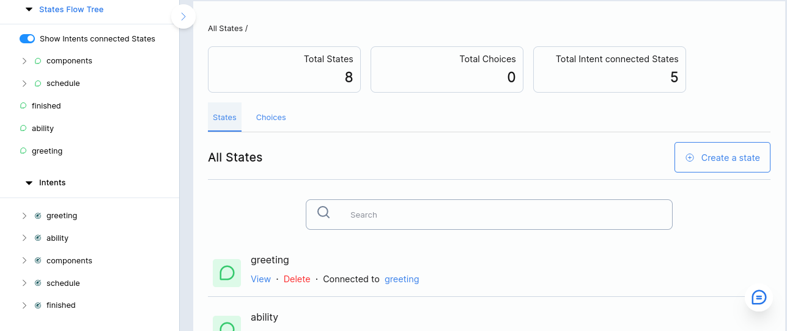
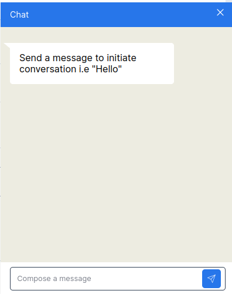

Do you prefer using the `terminal` or `graphical tools` to develop your chatbot? Worry out sarufi now gets you two choices to work with your chatbot. 
Like other development platfoprms, Sarufi provides two ways to get your chatbots developed and deployed as quick as possible.

To use the tools you will need to have `credentials` obtained after creating an account with [Sarufi](https://sarufi.io/).

# Using terminal
This tool has been covered in details under [**tutorial section**](https://sarufi.io/docs/intro).

:::note
You should have Sarufi installed to use this method to develop your chatbots
:::

Currently Sarufi has several SDK to get you statrted with the development. We have [Python](https://github.com/sarufi-io/sarufi-python-sdk), [Nodejs](https://github.com/sarufi-io/sarufi-js), [Golang](https://github.com/sarufi-io/sarufi-golang-sdk), [PHP](https://github.com/sarufi-io/sarufi-php) and [Dart](https://github.com/sarufi-io/sarufi-dart-sdk) SDKs.

Depending on your language of preference you can install the SDK and get your hands on work.
WIth the terminal, you can update/modify the bot then navigate into your browser to test your bot.

# Using Graphical tool

Sarufi also provides [graphical tool](https://sarufi.flexcodelabs.com) to develop chatbot in easy way. You just login and get your ideas in the flow of your chatbot.

Here you will easly visualize your chatbot intents, flow tree and have live conversation test of the bot.

You will be able to view useful insights such states,choices and intents about your chatbot

This method will give you quick way to develop chatbot and have a test on the goal. 

You can choose any tool of you preference to develop chatbot using **Sarufi**.
