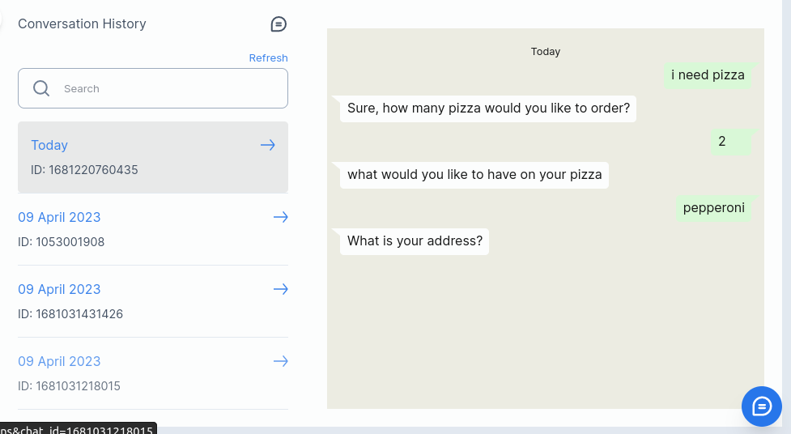
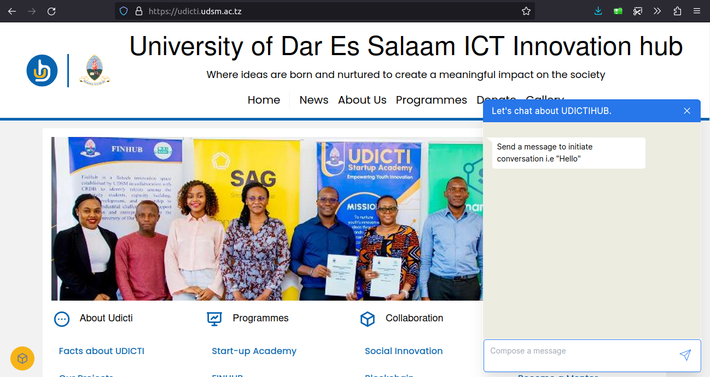
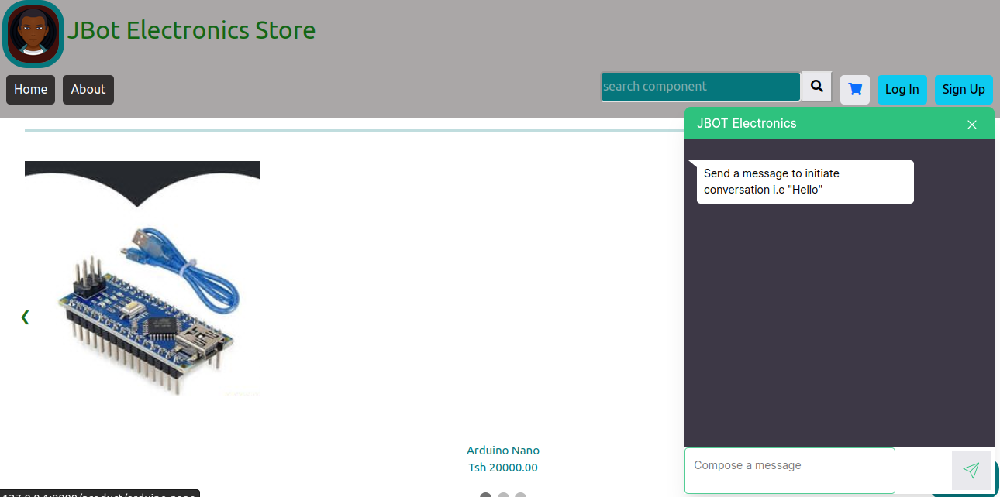
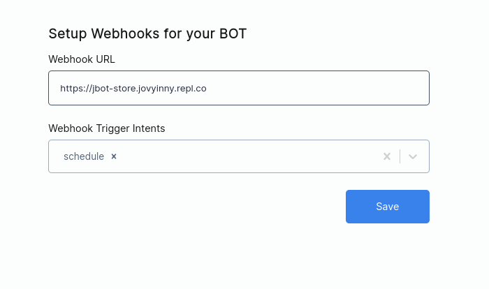
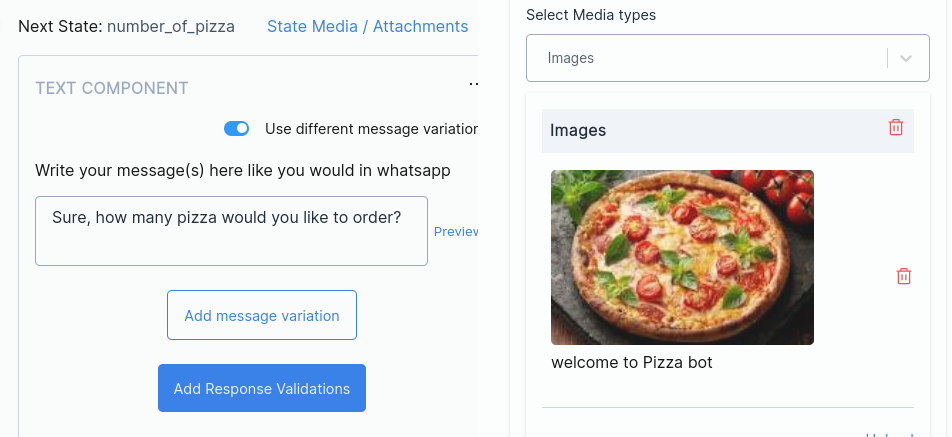
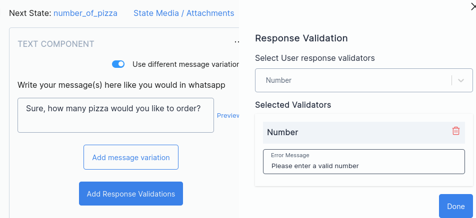
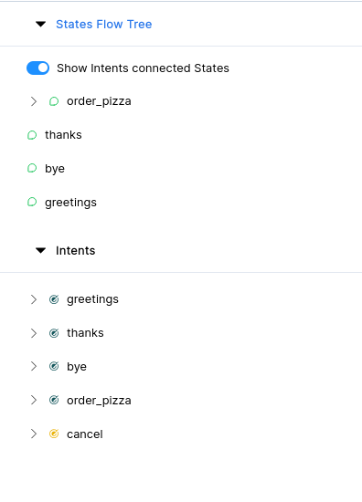

Developing chatbots should not cause headache 🤕. Let you say goodbye to the complexities of natural language processing with sarufi. Sarufi has got your back by introducing interactive interface to get you started with your chatbot idea. It is `No code/Low code` tool.

With a dashboard in place, you will be able to leverage the full power of your idea. Prior programming experience is not necessary. Your valuable concept 💬 is the only thing required.

Sarufi development tool simplifies the process as it lets you focus on other tasks while it handles the heavy lifting 🏋🏿‍♂️.

## Start using Dashboard

To get started with this interface, you will need to sign up with [sarufi](https://www.sarufi.io)

You can login 🔓 using either **Google** or **Github** account.

After logging in, we can now proceed with creating our new bot. On the dashboard tab, you will find no chatbot so lets and create one.

Click `Create a New Bot` Button, then fill important inforamtion about the bot.

The checkbox,☐ lets you decide to make your chat-bot publically available at [sarufi Community playground](https://playground.sarufi.io/community) for people to test. Sarufi playground is a public community where you can show case what you were able to accomplish with sarufi.

✅ Lets go into major features of the dashboard

## Major Features

### Live Testing

With the Interface, one is able to test his/her bot on the go without navigating to another web page.

You can eliminate every uncertainty with the live chat test of your bot. You can be sure that the chatbot you are creating will perform as planned.

It is super easy to use this feature. Click a blue chat button at the bottom right corner then you will have a room to test/chat with your chatbot.

### View conversation History

When you create your chatbot with sarufi, you will be able to view chat history. With chat history data at your view, you can do a lot to improve your customer experience. You can do things like:-

- Improve your bot to respond properly, be catchy to customers
- Cover area not intially implemented in your chatbot

✅ To view conversations simply click at the top bar `Conversations`.

### Website Plugin

With your chatbot idea, you do want to put it out there to solve something for your business. Sarufi provides you with a quick way to integrate your bot to a website. You just follow simple steps

With your chatbot created, you can easily integrated it within your website by following simple steps. Navigate to **Settings** at the top right --> **Customize Bot for your website**. Place your website `Url` and make changes on the appearance of the bot as you prefer it to look like. Click **save**

Below, you will have a snippet for `javascript` and `React`. Then copy a code snippet to paste in your HTML page or React/NextJS App.

✅ You can see one of the bot that has been integrated into [web](https://udicti.udsm.ac.tz/)

Here is the chatbot integration within development environment.

### Webhooks

Sarufi also supports webhook to conversation data with third-party APIs (payment gateway, CRM, etc) at any point of a conversation.

All you have to do is specify which states should trigger the webhook and set webhook url.

✅ On your account, Navigate to `settings` --> `Webhook`. Enter url and select trigger intents --> **`Save`**

### Media

The dashboard lets you add media to your bot. Your bot becomes more customer engaging with media in place. Media can be either of

- images
- videos
- documents
- stickers

This will also work exactly the same way deployed to messaging platforms like WhatsApp, Telegram or your website chat widget.

### Type Validation

With type validations, you will be comfortable to verify user response during conversation. Validations let you guide the user/customer on what they should provide as response.It can be a mobile number, email, or date.

### View Flows and intents

During development of your cahtbot, you might be eager to know what intents and state flows are currntly available. This is easy task in the dashboard as it provides you with a quick way to view state flows and intents.

These are found on the left side of the dashboard. Its easy to determine whether an intent is connected to a state or not. Thus making your bot readly avaibale for use without missing customer enquiries.

## Final word

The future with sarufi is so bright with more upcoming feature to improve your business operations. Sign up at [sarufi](https://www.sarufi.io) to fire up 🚀 that chatbot idea.
