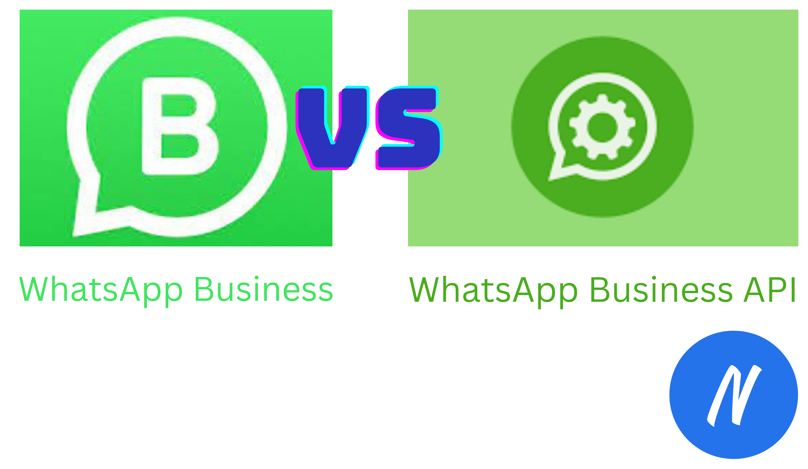
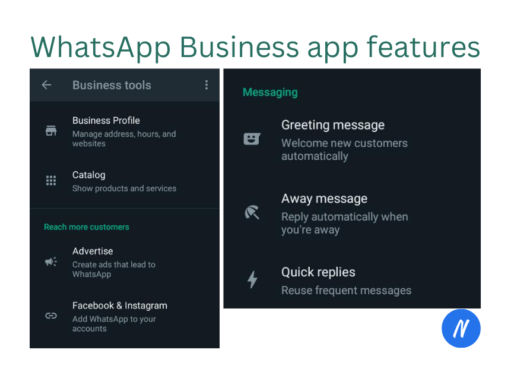
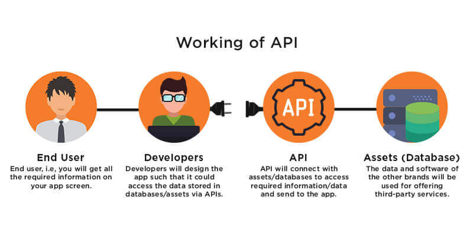

WhatsApp has made everything easy for businesses to expand, reach out and serve many customers as fast as possible. With whatsapp business app and API doing the great job, but i would like one to know the differences between the two. This will help you know how you business can benefit from either.

## Difference between WhatsApp Business App and API

As WhatsApp is a cross-platform messaging service allowing users to send text messages, voice messages, make voice, video calls, and share media(images, documents, user locations,...), it is widely used.

Its good to point out before starting our journey that whatsapp started with messenger app before the launch of business app. Let distinguish between the two, messenger and business app.

## Prepare for the journey

### Messenger App

With this app you can have personal conversations between friends and family. Besides sending text messages, you can share pictures , documents, start a video call and much more... .
You can also use stickers to spice up your conversations. This is suited for non-business people as it will not provide the user ability to do any automation.

### Business App

WhatsApp Business App is built with focus of small-medium business operation to easy customer communication. The app will help you in growing the business with its rich features such as business profile, product catalog, quick messaging(away messages, greeting messages). This is focused on small to medium businesses.

Business App can do all messenger app can do with added bonus to work in a business manner...
WhatsApp business.
With WhatsApp business, there are two distinct products namely whatsapp business app(discussed above) and WhatsApp business API. Lets dive into business API.

## What is an API?

Let's do a quick elaboration of what an API is?

An API(Application Programming Interface) is communication mechanism that allows two software/programs to communicate together under set communication protocols.

The use of WhatsApp business API is to enable advanced automation of business operations such as using A.I power chatbots, customer care services, hence likely preferred for large organizations.

### WhatsApp business API

WhatsApp Business API enables businesses to automate communications with automated replies, WhatsApp chatbots and interactive messages. In short, WhatsApp Business API helps businesses to create a personalized communication flow that works best for their customers.

Lets start our journey by diging into differences between business app and API.

## Business app vs Business API

Lets see some major diffrences between the two basing on the following criteria

1. WhatsApp Automation

This is a key part of discussion in this article. Here is where you can understand what is meant when someone says "chatbot integration with Whatsapp". Lets get into it.

On automation side, an app provides few automation techniques such as qiuck replies, greeting messages and away messages.
Using API, a business will have ability to do more advanced automations mostly using A.I powered chatbots, connecting whatsapp to CRM, customer care support an much more... The focus though here is discussing on the use of chatbots in whatsapp.

You can build whatsapp-ready chatbots using [sarufi](https://sarufi.io). With sarufi, your chatbot will be availble in whatsapp in matter of minutes.

Whatsapp business API gives the business ability integrate with a chatbot. So whenever we speak something of chatbot integration in whatsapp, we will be referring to Business API.

2. Set up

Using an App, the set up is fast as you just need to download the app ``>>`` register your number for whatsapp business `>>` fill some important information about your business.

Business API, you will need a [WhatsApp cloud account](https://developers.facebook.com/docs/whatsapp/cloud-api/get-started) or using whatsapp business partners to have your business number verified. The process may take some work days.

3. Cost

You do not have to pay to use a Business app, just download and ready to put your business into operation. Thats why it is convient for small businesses.

While Business API needs to be paid for to utilize it fully in production. With an API, business can obtain a verification tick. This shows your customers that the account is genuine and safe to interact with, resulting in more engagement.(Though the application process takes time).

4. Usage and number of devices

With the App, WhatsApp targets small to medium businesses that can manage to handle customers with few automation needs. It allows business operators to chat individually with customers. With it can be used on multiple devices with custom interfaces. It allows upto 5 connected devices to enable businesses to work with a shared business account.

The API, is mainly focused on large organizations that would like to rely more on advanced automation to serve their huge customers.

This is no limit that only large organizations can use the API, even small and medium businesses can apply for API usage in production to leverage the power of Advanced automation such as A.I powered chatbots like those built using sarufi.

An app allows connection of up to 5 devices to a. With an APP, you can make calls where as an API protocol does not allow making calls.

5. Messaging

WhatsApp business App allows the business to send unlimited messages and of any content any any time.
For WhatsApp Business API conversations fall into two categories that are priced differently with all having a 24 hours reply window.

- User-initiated

    A conversation that initiates in response to a user message. Whenever a business replies to a user within the 24 hour [customer service window](https://developers.facebook.com/docs/whatsapp/overview/messages), that message will be associated with a user-initiated conversation. Businesses can send free-form messages within this 24 hour customer service window. With user initiated conversation, the business can reply without message limits and no content limit(you can use medias here such as images, videos, files,...)

- Business-initiated

    A conversation that initiates a business initiates by sending a user a message outside a 24 hour customer service window. These messages use [message templates](https://developers.facebook.com/docs/whatsapp/api/messages/message-templates) which have limited contents that can be used, also templates are to be verified by whatsapp before getting into usage.

## Destination words

As we finish up our short journey on the difference between Business App and API, you must have a clear undersatnding of what is meant about chatbot integration in whatsapp. To get your business a whatsapp integration ready boat, please [contact us](https://www.neurotech.africa/#contact)
