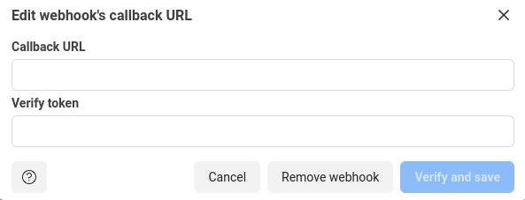
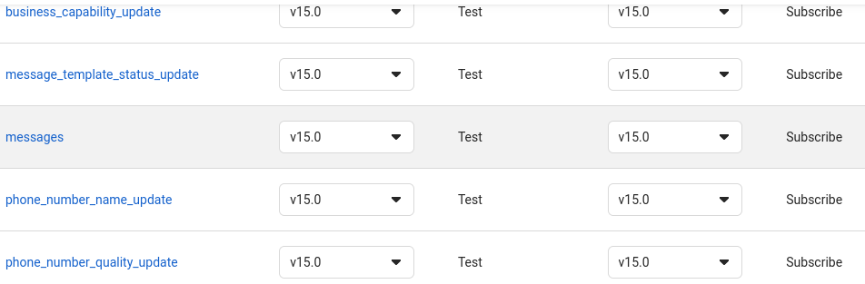

# WhatsApp

WhatsApp is a freeware, cross-platform messaging and Voice over IP (VoIP) service owned by Facebook, Inc. It allows users to send text messages and voice messages, make voice and video calls, and share images, documents, user locations, and other media.

WhatsApp is one of the most popular messaging apps in the world. It has over 2 billion active users and is available in 120 different languages.


## How to connect to WhatsApp Cloud API

To connect to WhatsApp Cloud API, you need to create a WhatsApp Business account. You can do this by following the instructions in the [Get started-cloud API](https://developers.facebook.com/docs/whatsapp/cloud-api/get-started).

In this part of integration with whatsapp, I will walk you the journey using `python`.

### What you need

You will need a [webhook](https://www.redhat.com/en/topics/automation/what-is-a-webhook) to receive whatsapp messages. There are several ways this can be done. This tutorial will guide you in using [ngrok](#using-ngrok) or [replit](#using-replit).

## Using Ngrok

Make sure you have [ngrok](https://ngrok.com/) installed in your working machine.

### Quick setup

Have [sarufi package](https://github.com/Neurotech-HQ/sarufi-python-sdk) installed on your machine before launching your whatsapp bot.

- Create project folder.

  Lets Make a project folder named `whatsapp-bot`. Navigate into it to create virtual evironment `whatsapp-bot-env`. Activate the environment and install sarufi.

  Run the command to make the magic 🔥 happen.

  ```bash
  mkdir whatsapp-bot
  cd whatsapp-bot
  python -m venv whatsapp-bot-env
  source  whatsapp-bot-env/bin/activate
  pip3 install --upgrade sarufi
  ```

- Create a file named `.env` in your working folder to hold environment variables by running.
  
  ```bash
  touch .env
  ```
  
   In the file add the following. Read on how to [get whatsapp creds](#whatsapp-cloud-creds)

   ```bash
    sarufi_username = Your sarufi username
    sarufi_password = Your sarufi password
    sarufi_bot_id   = Your Bot Id
    whatsapp_token  = Your Whatsapp token
    phone_number_id = whatsapp phone number id
  ```
  
- Once you have environment variables set, you are ready to fire 🚀 your `app.py` in activated virtual envirnoment.

  ```bash
  python3 app.py
  ```

  Then run the command below to start ngrok

  ```bash
  ./ngrok http 5000
  ```

  **`Note:`** keep the port number the same as used in `app.py`

- Finish up. After ruuning the command, you will have to copy the url ngrok provides. The url looks like `https://xxxxxxxxxxx.ngrok.io`

  With the provided url, follow simple steps at [Setting whatsapp webhook](#setting-whatsapp-webhook).

  Open `app.py`, copy the `VERIFY_TOKEN`--> paste into verify token in your whatsapp cloud --> **verify and save**.

  We are heading a the best part of this journey. Just take time to [subscribe to message topic](#webhook-field-subscription).
  When done ,you are good to go... fire up your bot in whatsapp by sending text.

  🏁 When done with saving the token and url, go on to text your bot.

## Using Replit

- Log into your [Replit](https://replit.com/) account.
  
  Create a python repl. Download `main.py` from [Whatsapp bot using sarufi API and heyoo](https://replit.com/@jovyinny/Whatapp-bot-using-Sarufi-api-and-heyoo).

  Upload/copy `main.py` code into your replit repl created.  In your repl, navigate to Tools --> packages, then install `heyoo`.

  Navigate to Tools--> Secrets to create environment variables. Read [Getting whatsapp creds](#whatsapp-cloud-creds).

  Create

    |Secrete key               | Description            |
    |:---                      |:---                    |
    |`phone_number_id`         | Whatsapp cloud phone ID|
    |`whatsapp_token`          | Your whatsapp token    |
    |`sarufi_username`         | Your sarufi username   |
    |`sarufi_password`         | sarufi password        |
    |`sarufi_bot_id`           | Your sarufi bot id     |

- Run the script
  
  After creating the secret keys, run your `main.py`. A small webview window will open up with a url that looks like `https://{your repl name}.{your replit usermae}.repl.co`.

  With the url, follow simple steps at [Setting whatsapp webhook](#setting-whatsapp-webhook).

- Final touches

  Go into your repl, copy the `VERIFY_TOKEN` --> paste into verify token in your whatsapp cloud --> **verify and save**.

  We are reaching at a good point with the set-up. Lets [subscribe to message topic](#webhook-field-subscription).
  When done ,you are good to go... fire 🚀 up your bot in whatsapp by sending text.

## Whatsapp cloud creds

Navigate to `Whatsapp`-->`Getting started` to get whatsApp cloud `token` and `phone number ID` to be used.

You will have access token and phone number id.


## Setting whatsapp webhook

Navigate to your whatsapp cloud account --> `configuration` --> edit --> then paste the url into callback url.
  


## Webhook field subscription

After veryfing and saving whatsapp webook, navigate to webhook fields --> click `manage` to subscribe to `message` topic.



## How to test WhatsApp

You can test WhatsApp by sending a message to your bot.

## What you learned

In this tutorial, you learned how to connect Sarufi to WhatsApp Cloud API. You also learned how to configure and run WhatsApp.
